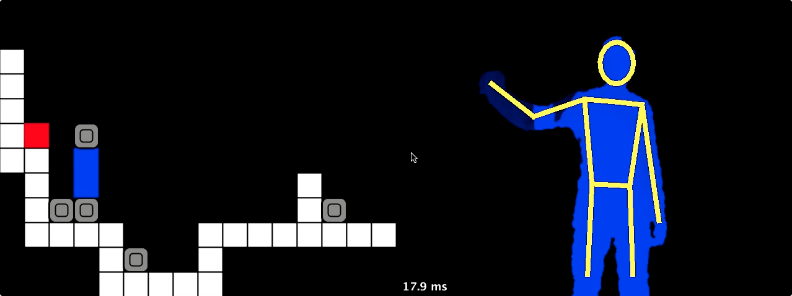

BlockDude Kinect
================

BlockDude is a puzzle game that I used to play on my TI-83 calculator. There is a [playable version](http://azich.org/blockdude/) online by Andrew Zich and Pete Zich. This project recreates the basic mechanics of the game, as well as a couple levels, using the Kinect as a gestural input device. It also allows you to create custom levels with a simple text file.

This screenshot shows the app while the user is performing a "place block" gesture:

Installation
------------

### Dependencies (Mac/Linux)

* libusb-1.0-0-dev
* freeglut3-dev
* [OpenNI](http://www.openni.org/Downloads/OpenNIModules.aspx)
* [SensorKinect](https://github.com/avin2/SensorKinect/)
* [PrimeSense NITE](http://www.openni.org/Downloads/OpenNIModules.aspx)
* Xcode (Mac)

### Installation

1. Download the unstable version of the OpenNI library. Run `sudo ./install.sh` in the OpenNI directory.
2. Download the unstable version of the NITE library. Run `sudo ./install.sh` in the NITE directory.
3. Download SensorKinect from avin2.
	* `cd Platform/Linux/CreateRedist`
	* `./RedistMaker`
	* `cd ../Redist`
	* `sudo ./install.sh`

The instructions available [here](http://thecolormursh.blogspot.com/2011/01/kinect-nite-mac-os-x.html) or on the [SensorKinect page](https://github.com/avin2/SensorKinect) may also be helpful to get your machine set up correctly.

Also note that you must install each package in the order above.

Usage
-----

### Running the code

Compiling and running the code should be as simple as running `./compile.sh` then `./run.sh` from the project directory, provided that you have installed the libraries above correctly. In particular, you must have `org.OpenNI.jar` and `com.primesense.NITE.jar` in your `/usr/share/java` folder, and all of the NITE libraries in `/usr/lib`.

### Controls

#### Movement:

* Tilt body left/right

#### Picking up block

* Keeping your arm straight, raise it above your head

#### Dropping a block

* Bring your hand close to your shoulder
* Push your arm out straight

Writing Custom Levels
---------------------

Levels are pre-loaded from the `levels` directory using any file with the `.lvl` extension. Levels are represented as two-dimensional text files, with numbers separated by spaces and rows separated by newlines.

**Level One**

    0 0 0 0 0 0 0 0 0 0 0 0 0 0 0 0 0 0 0
    0 0 0 0 0 0 0 0 0 0 0 0 0 0 0 0 0 0 0
    0 0 0 0 0 0 0 0 0 0 0 0 0 0 0 0 0 0 0
    0 0 0 0 0 0 0 0 0 0 0 0 0 0 0 0 0 0 0
    0 0 0 0 0 0 0 0 0 0 0 0 0 0 0 0 0 0 0
    0 0 0 0 0 0 0 0 0 0 0 0 0 0 0 0 0 0 0
    0 0 0 0 0 0 0 0 0 0 0 0 0 0 0 0 0 0 0
    0 0 0 0 0 0 0 0 0 0 0 0 0 0 0 0 0 0 0
    8 0 0 0 0 0 0 0 0 0 0 0 0 0 0 0 0 0 8
    8 0 0 0 8 0 0 0 0 0 0 8 0 0 0 0 0 0 8
    8 1 0 0 8 0 0 8 0 3 0 8 0 3 0 7 0 0 8
    8 8 8 8 8 8 8 8 8 8 8 8 8 8 8 8 8 8 8

The numbers with special meaning are:

* `0`: Air
* `1`: Door
* `3`: Moveable Block
* `7`: Initial user position
* `8`: Ground

Bugs
----

An out of memory error occurs at unpredictable intervals.

Credits
-------

This app is modified from the [GorillaGesturesTracker](http://fivedots.coe.psu.ac.th/~ad/jg/nui1610/index.html) app by Dr. Andrew Davison, who has written a very helpful [book about OpenNI](http://fivedots.coe.psu.ac.th/~ad/kinect/index.html).

All major modifications from the original source are tagged WYLIE.

I used two snippets of code from StackOverflow answers: [Counting number of lines in a file](http://stackoverflow.com/questions/1277880/) and [reading integers from a file](http://stackoverflow.com/questions/5697763/).
